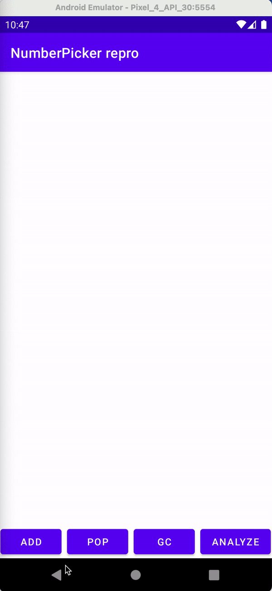

# databinding_doesnt_work_again
Databinding memory leak  
https://issuetracker.google.com/issues/176886060

```
┬───
│ GC Root: System class
│
├─ androidx.databinding.ViewDataBinding class
│    Leaking: NO (a class is never leaking)
│    ↓ static ViewDataBinding.sReferenceQueue
│                             ~~~~~~~~~~~~~~~
├─ java.lang.ref.ReferenceQueue instance
│    Leaking: UNKNOWN
│    ↓ ReferenceQueue.head
│                     ~~~~
├─ androidx.databinding.ViewDataBinding$WeakListener instance
│    Leaking: UNKNOWN
│    ↓ ViewDataBinding$WeakListener.mObservable
```


